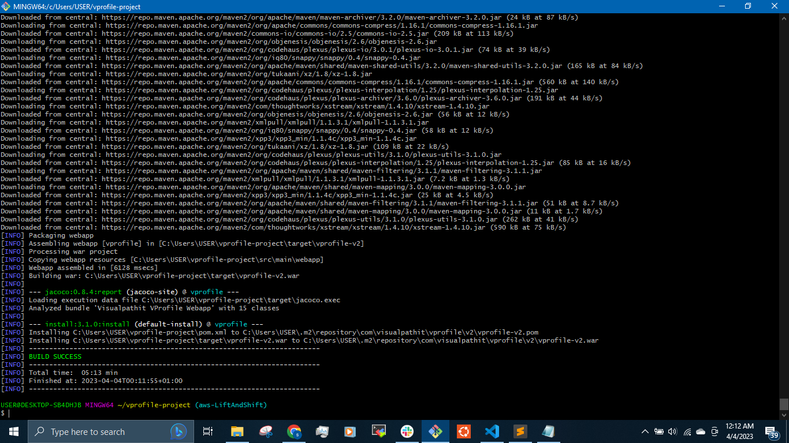

## __LIFT AND SHIFT MIGRATION TO CLOUD - LIFT AND SHIFT APPLICATION WORKLOAD__ ##

The __Lift and Shift  Migration Approach__ is about migrating your application and associated data to the cloud with minimal or no changes. Applications are effectively “lifted” from the existing environments and “shifted” as-is to a new hosting premises; i.e. in the cloud. As such, there are often no significant changes to make in the application architecture, data flow, or authentication mechanisms. 

__About the Project:__

We are going to employ the __Lift and Shift  Migration Approach__ to migrate __MULTI TIER WEB APPLICATION STACK__ to the AWS Cloud, host and run it for Production.

__Scenario:__

We have application Services running on Physical/Virtual Machines. This services could include: databases(mysql, Postgresql, Oracle etc), application services(tomcat), LAMP STACK and DNS services.
All these workload are in our Data center - so many workload running variety of services  on our local data center.

To manage all these, we will need Virtualization Team, Data Center Operations team, Monitoring Team and system administration teams working round the clock.

__Problem:__
- Managing all these services becomes complex.
- Scaling Up/Down becomes complex.
- Upfront capital Expenses and Regular Operation Expenses.
- Most of the processes are manual
- Difficult to automate and it is time consuming.

__Solution:__

The solution to these problems is hirng a cloud computing setup. The benefits include:
- We do not pay for the upfront cost for procuring the resource - we pay as go.
- Infrastructure as a Service (IAAC)
- Flexibility - Elastic in nature, we can scale out or scale in as needed or required.
- Managing Infrastructure becomes easier.
- Automation - Every step and process can be automated to avoid human errors.
- Saves time.

__AWS Services__

The services we are going to be using in this Project include:

- __EC2 Instances__ - For Tomcat, RabbitMQ, Memcache and Mysql
- __Elastic Load Balancer__ - To replace Nginx Load Balancer
- __Auto Scaling__ - For Automation of Virtual Machine Scaling(to scale out or scaling our EC@ Instances which will automatically control our resources and it is cost effective)
- __S3 or EFS__ - For storage - For shared storage.
- __Route 53__ - For private DNS Service.
- other services include: __IAM__ and __ACM__.

__Objective:__

- Flexible Infrastructure.
- No Upfront cost - Pay As You Go Model.
- Modernize our Application more effectively by using AWS.
- Automation - Infrastructure as a Code(IAAC).

__ARCHITECTURE OF THE MULTI TIER WEB APPLICATION STACK__

The architecture of our multi tier web application stack to be migrated to the cloud 


__AWS Cloud Multi Tier Architecture__


Users will access our website by using a URL that will point to an endpoint. This entry will be mentioned in __namesilo__ DNS. The users of the Application will use this end point to connect to the Load Balancer by using _https_. The certificate for the _https_ encryption will be mentioned in the Amazon Certificate Manager Service (ACM). Our Load balancer will be in a security group of it's own and will only allow _https_ traffic. Then our Application Load Balancer will route the request to Tomcat Instances. Apache Tomcat will be running on some set of Ec2 instances which will be managed by an __Auto Scaling Group__ - as per high or low load, these instance capacity will be scaled out or scaled in. These Ec2 instances where tomcat is running will be in a seperate security group which will __only__ allow traffic from __port 8080__ from Load Balancer.
The information of the IP address of our backend services will be mention in __Route 53 private DNS zone__ which tomcat will use in accessing the backend services - __Mysql, Memcache and RabbitMQ__.
These backend services will be in a seperate security group.

__N/B:__
Purchase a domain name from _godaddy, namesilo, namecheap_ etc and do the validation from the domain provider.

## __FLOW OF EXECUTION__

- Login to AWS Account
- Create Key pairs
- Create Security Groups
- Configure instances with user data (Bash Script)
- Update IP to name mapping in route 53
- Build Application from source code - this will be done in our local machine(computer).
- Upload the build artifact to S3 bucket
- Download artifact to tomcat Ec2 Instance.
- Set up Elastic Load Balancer with HTTPS (Amazon Certificate Manager)
- Map Elastic Load Balancer endpoint to website name in __Namesilo__ DNS.
- Verify our entire setup.
- Create an Auto Scaling Group for the Apache tomcat Instances.

__Create Keypairs__

First, we create a keypair 


__Create Security Groups__

We create Security Group for our Elastic Load Balancer.


We will add rules for __IPv4__ and __IPv6__ for __http port 80__ and __https port 443__. We will be needing the http port 80 for initial setup but the main goal is to connect securely using https port 443.

Next, we create security group for our Tomcat application instances.


Tomcat runs on port 8080 and  will only allow traffic from Elastic Load balancer (ELB) security Group.

Create security groups for the backend services - Mysql, Memecache and RabbitMQ


We open __Port 3306 for Mysql__, __Port 11211 for Memecache__ and __Port 5672 for RabbitMQ__ and allow them to connect only to tomcat security group.
We can verify which ports these backend services are running on from the the __application.properties__ file in the __src__ of the __aws lift and shift__ branch repository.

We will save the backend security group to create the backend security group, then edit to add rule __all traffic__ for the backend services to interact with each other.


__Configure instances with user data__

We will use the bash scripts from our source code to provision our services and launch our Ec2 instances using __User data__. 

`$ git clone https://github.com/devopshydclub/vprofile-project.git`

`$ cd vprofile-project/`

`$ ls`

`$ git checkout aws-LiftAndShift`

`$ ls`

`$ cd userdata`

`$ ls`


First we will create a __Centos 7 AMI instance__ and provision __Mysql__ using the bash script below through the __user data__ section while launching the instance.

```
#!/bin/bash
DATABASE_PASS='admin123'
sudo yum update -y
sudo yum install epel-release -y
sudo yum install git zip unzip -y
sudo yum install mariadb-server -y


# starting & enabling mariadb-server
sudo systemctl start mariadb
sudo systemctl enable mariadb
cd /tmp/
git clone -b vp-rem https://github.com/devopshydclub/vprofile-repo.git
#restore the dump file for the application
sudo mysqladmin -u root password "$DATABASE_PASS"
sudo mysql -u root -p"$DATABASE_PASS" -e "UPDATE mysql.user SET Password=PASSWORD('$DATABASE_PASS') WHERE User='root'"
sudo mysql -u root -p"$DATABASE_PASS" -e "DELETE FROM mysql.user WHERE User='root' AND Host NOT IN ('localhost', '127.0.0.1', '::1')"
sudo mysql -u root -p"$DATABASE_PASS" -e "DELETE FROM mysql.user WHERE User=''"
sudo mysql -u root -p"$DATABASE_PASS" -e "DELETE FROM mysql.db WHERE Db='test' OR Db='test\_%'"
sudo mysql -u root -p"$DATABASE_PASS" -e "FLUSH PRIVILEGES"
sudo mysql -u root -p"$DATABASE_PASS" -e "create database accounts"
sudo mysql -u root -p"$DATABASE_PASS" -e "grant all privileges on accounts.* TO 'admin'@'localhost' identified by 'admin123'"
sudo mysql -u root -p"$DATABASE_PASS" -e "grant all privileges on accounts.* TO 'admin'@'%' identified by 'admin123'"
sudo mysql -u root -p"$DATABASE_PASS" accounts < /tmp/vprofile-repo/src/main/resources/db_backup.sql
sudo mysql -u root -p"$DATABASE_PASS" -e "FLUSH PRIVILEGES"

# Restart mariadb-server
sudo systemctl restart mariadb


#starting the firewall and allowing the mariadb to access from port no. 3306
sudo systemctl start firewalld
sudo systemctl enable firewalld
sudo firewall-cmd --get-active-zones
sudo firewall-cmd --zone=public --add-port=3306/tcp --permanent
sudo firewall-cmd --reload
sudo systemctl restart mariadb
```

The __backend Security Group__ and the keypair will be used to Lauch the instance while the __user data__ section will be used to provision the instance.


The instance will take sometime to initialize because it will be provisioning the instance using the bash script in the user data.


To validate the instance, we will login into the instance to make sure it was properly provisioned we need to add rule to allow ssh into the instance.

We will only allow ssh from My IP for security reasons.


To check if our instance was provisioned properly, we check the status of our __mariadb__ service.

`$ sudo systemctl status mariadb`


We log into the database

`$ mysql -u root -p`

`mysql> show databases;`

`mysql> use accounts`

`mysql> show tables;`


If we are not able to see the status of the mariabd, we can check the process using the command

`$ ps -ef`

Next, we will be provisioning __Memecache__. We will be using centos 7 for this

The script to be used for the provisioning

```
#!/bin/bash
sudo yum install epel-release -y
sudo yum install memcached -y
sudo systemctl start memcached
sudo systemctl enable memcached
sudo systemctl status memcached
sudo memcached -p 11211 -U 11111 -u memcached -d
```

We will use the __backend Security Group__ and the keypair to Lauch the instance while we use the __user data__ section to provision the instance.


To validate the instance, we will login into the instance and check the status of the __memcached__ service.

`$ sudo sysytemctl status memcached`

Then we will check if it is running on the right port 

`$ ss -tunlp | grep 11211`


Next, we will be provisioning __RabbitMQ__. We will be using centos 7 for this

```
#!/bin/bash
sudo yum install epel-release -y
sudo yum update -y
sudo yum install wget -y
cd /tmp/
wget http://packages.erlang-solutions.com/erlang-solutions-2.0-1.noarch.rpm
sudo rpm -Uvh erlang-solutions-2.0-1.noarch.rpm
sudo yum -y install erlang socat
curl -s https://packagecloud.io/install/repositories/rabbitmq/rabbitmq-server/script.rpm.sh | sudo bash
sudo yum install rabbitmq-server -y
sudo systemctl start rabbitmq-server
sudo systemctl enable rabbitmq-server
sudo systemctl status rabbitmq-server
sudo sh -c 'echo "[{rabbit, [{loopback_users, []}]}]." > /etc/rabbitmq/rabbitmq.config'
sudo rabbitmqctl add_user test test
sudo rabbitmqctl set_user_tags test administrator
sudo systemctl restart rabbitmq-server
```

We will use the __backend Security Group__ and the keypair to Lauch the instance while we use the __user data__ section to provision the instance.


To validate the instance, we will login into the instance and check the status of the __rabbitMQ__ service.


So our backend stack have been validated and are up and running


__Update IP to name mapping in route 53__

We will update the private IP of these three instances in __Route 53__ orivate DNS zones.

We go to __Route 53__ and create hosted zone for the backend servers.


We choose __simple routing__


Create records for db01, mc01 and rmq01


All backend server records mapped in __Route 53__


In our __application.properties__ file in the source code, we will mention these mapped names and not the IP addresses. Even if we replace the backend servers and the same names are mapped to the IP addresses, we will not need to make changes in the application server(tomcat).

__Build Application from source code__

We will start an instance for our __tomcat__ and provision it so we can build our source code into an artifact to be deployed to s3 bucket.

The user data for the provisioning of our tomcat

```
#!/bin/bash
sudo apt update
sudo apt upgrade -y
sudo apt install openjdk-8-jdk -y
sudo apt install tomcat8 tomcat9-admin tomcat9-docs tomcat9-common git -y
```
We will use the __tomcat security group__ for the tomcat server and the user data section to provision the instance.


To validate, we check the status of the __tomcat__ service.

`$ sudo systemctl status tomcat9`


Make sure to open port 22 for ssh.

To build the source code locally, we will install __maven__ and __java__ in our local machine.

Open __POWERSHELL__ and __run as administartor__. Install __maven__ and __jdk8__


The __java__ version on __maven__ should be the same as the __jdk8__ version. If not should uninstalled and installed again.

In our __application.properties__ file we will update the backend servers with their mapped DNS.


Open the __application.properties__ file

`$ vim application.properties`

and update the file


__N/B:__

Changes are made here if any of the port numbers were changed.

Go bak to where we have the __pom.xml__ file and run the command

`$ mvn install`




When the artifact build is complete, we can find the artifact - __vprofile-v2.war__ in the __target__ directory.


To upload the artifact to __S3__ bucket, we need to install __awscli__ using __Powershell__


Create an __IAM__ user make sure the __Identity Access Management (IAM)__ User has __S3fullaccess__ permission.


Make sure to download the __.csv__ file


Go to __security credentials__ and set up the __access key__ and __secret key__ that we will use to configure the __AWSCLI__.


We use the the keys to configure  the __AWSCLI__


__Upload the build artifact to S3 bucket__

Create the __S3 bucket__  from the command line.

`$ aws s3 mb vprofile-artifacts`


- The S3 bucket name has to be unique because there are other existing buckets in S3.

To upload the artifact to S3 bucket

`$ cd vprofile-project`

`$ cd target`

`$ aws s3 cp vprofile-v2.war s3://vprofile-artifacts/`

`$ aws s3 ls s3://vprofile-artifacts/`


__Download artifact to tomcat Ec2 Instance__

In other to download the artifact into the tomcat Ec2 instance, we will create a role - IAM role


We setup the tomcat Ec2 Instance to use the IAM role.


Go into the __/var/lib/tomcat9__

`$ cd /var/lib/tomcat9`

`$ ls`

Go into the __webapps__ directory

`$ cd webapps`

Stop the tomcat server

`$ sudo systemctl stop tomcat9`

Remove the __ROOT__ directory in the webapps directory

`$ sudo rm -rf ROOT`


To download the artifact from the S3 bucket, we need to install the __awscli__ in the tomcat server


We dont need to configure the __awscli__, we will jjst use the attached role.

To download the artifact to tomcat

`$ aws s3 ls s3://vprofile-artifacts`

Copy the artifact into __/tmp/__ directory

`$ aws s3 cp s3://vprofile-artifacts/profile-v2.war /tmp/`

`$ cd /tmp/`

`$ ls`


We make the __vprofile-v2.war__ the default directory in the __webapps__ directory i.e __ROOT__

`$ sudo cp vprofile-v2.war /var/lib/tomcat9/webapps/ROOT.war`

Start the tomcat server

`$ sudo systemctl start tomcat9`


To validate that the setup in __applications.properties__ has the right changes


`$ sudo -i`

`$ cd /var/lib/tomcat9/webapps/ROOT`

`$ cd WEB-INF`

`$ cd classes`

`$ cat application.properties`


We can see the __Route 53__ update in the __application.properties__ file.

We can install __telnet__ to check for connectivity to the backend servers.

`$ sudo apt install telnet -y`

and run the commands to check if we are able to connect to the backend servers

`$ telnet db01.vprofile.in 3306`

`$ telnet mc01.vprofile.in 11211`

`$ telnet rmq01.vprofile.in 5672`


When the tomcat application is not able to connect to backend servers, we check the ports numbers and IPs that it is using to connect.

To disconnect, we use `ctrl + ]` which takes you into the telnet console then `close`

`$ ctrl + ]`

`telnet> close`

__Set up Elastic Load Balancer with HTTPS (Amazon Certificate Manager)__

To create the Load Balancer, we need to first create a __Target group__ for the tomcat instances that the Load Balancer will connect to.


Next we create the __Load Balancer__


We select atleast __2 availability zones(AZ)__ for High Availability of the Load balancer.


Add listeners __HTTP port 80__ and __HTTPS port 443__ to forward traffic to the __security group__ of the tomcat.


When we select the __HTTPS__, we must mention the certificate that we have validated with the domain provider of our domain name i.e __mydevopsproject.top__


- Make sure you are in the right region with the certificate and the certificate is validated.

Then we crteate the Load Balancer


__Map Elastic Load Balancer endpoint to website name in _Namesilo_ DNS__


Copy the __DNS Name__ of the Load balancer


Log into the domain service provider in this case -  __namesilo.com__.

Go to  __manage DNS__ in create a __C_NAME__.

We set the hostname ( __vprofile__ ) to point to the  __target hostname__ ( __DNS Name__ copied from the Load Balancer)


Wait for the Load Balancer to become __active__


Then we can access the app from the webpage using 

`https://vprofileapp.mydevopsproject.top`


Login using the log in details below

Login: __admin_vp__

Password: __admin_vp__


__Verify our entire setup__

Succesful login shows that the database server is connected.

To check if the rabbitMQ is functioning, we click on __rabitMQ__ on the website.


To check the __memcached__, click on all users and select a user.


Then go back and select the same user


We will find out that the first time we selected the user the __data__ was from the __Database__ and it took longer time to open but the second time it was faster to access and was from the __cache__.

__Create an Auto Scaling Group for the Apache tomcat Instances__

To setup __Auto Scaling Group__ for our tomcat Ec2 Instance,

First, we need to create the __AMI__ of the instance to be used to configure our __Launch Configuration/Launch Template__.


Create the __Launch Configurations__ for the Auto Scaling Group.


Create __Auto Scaling Group__

Swith to __lauch Configurations__ and select our launch configuration from the drop down.


Select all Availability Zones for high availability so our instance can be lauched in any of the zones.


The ASG lauches two instances as per our Lauch configuration set up


We can now terminate the __vprofile-app01__ as we have created an Auto Scaling Group for it.

The new instances can be seen in our __target group__


We have successfully employed __Lift and Shift to Migration Approach__ to migrate our application to the cloud __AWS Cloud__.

- All scripts for this project can be found in [vprofile-project](https://github.com/dybran/vprofile-project).


